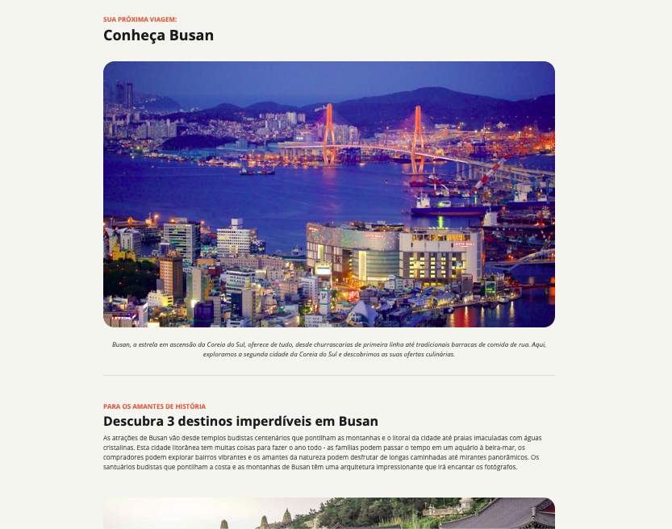

## Desafio: Página de Local Turístico

Este projeto é um desafio proposto pelo curso Fullstack com JavaScript da [`@Rocketseat`](https://rocketseat.com.br). O objetivo é criar uma página que exiba um local turístico e seus detalhes, utilizando apenas `HTML` e `CSS`.



<table align="center">
<tr>
  <td><a href=""><strong>Link</strong> do figma</a></td>
</tr>
</table>

## Objetivos do Projeto
- **Estrutura HTML:** Criar uma estrutura semântica e bem organizada para a página.
- **Fontes:** Utilizar fontes personalizadas para melhorar a estética do site.
- **Imagens:** Incluir imagens do local turístico para enriquecer a experiência do usuário.
- **Cores e Pesos dos Textos:** Alterar as cores e os pesos dos textos para destacar informações importantes.
- **Lista Desordenada:** Utilizar listas desordenadas para apresentar detalhes ou características do local.
- **Espaçamento:** Aplicar espaçamentos adequados para melhorar a legibilidade e o design da página.
- **Estilização com CSS:** Criar estilos personalizados para tornar a página visualmente atraente e responsiva.

## Tecnologias
- **HTML:** Para a estruturação do conteúdo da página.
- **CSS:** Para a estilização e design da página.

## Como Executar o Projeto

1. Clone este repositório:
```bash
git clone https://github.com/matheussouza4/local-turistico.git
```
2. Navegue até a pasta do projeto:
```bash
cd local-turistico
```
3. Abra o arquivo index.html no seu navegador para visualizar a página.

### Estrutura do Projeto

- **index.html:** Arquivo principal que contém a estrutura HTML da página.

- **styles/:** Pasta que contém o arquivo CSS para estilização da página.

- **assets/:** Pasta que contém as imagens e outros recursos utilizados na página.
